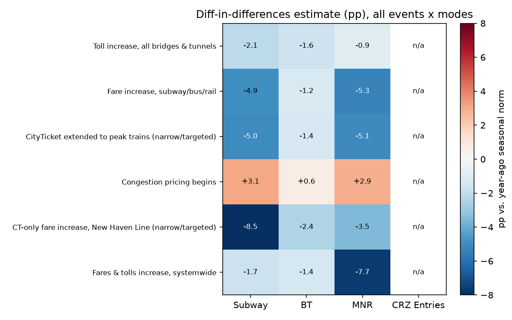

# HW0 — NYC Transit & Congestion Pricing

**Question (from Class 1):** explore NYC transit data (subway, bridges, Metro-North) and assess
the impact of congestion pricing events on ridership.

**Data:** MTA Daily Ridership and Traffic: Beginning 2020 (`data.ny.gov`, sayj-mze2), daily counts
by mode, Mar 2020–Aug 2026 in this extract. Every fare/toll/policy change in the sample window,
from `data/MTA_Key_Dates.pdf`:

| Date | Change | Scope |
|---|---|---|
| Aug 6, 2023 | Toll increase, all bridges & tunnels | Broad |
| Aug 20, 2023 | Fare increase, subway/bus/rail | Broad |
| Aug 21, 2023 | CityTicket extended to peak trains | Narrow (LIRR/MNR CityTicket riders only) |
| Jan 5, 2025 | Congestion pricing begins | Broad (vehicles into Manhattan CBD) |
| Sept 1, 2025 | CT-only fare increase, New Haven Line | Narrow (Connecticut-origin MNR riders only) |
| Jan 4, 2026 | Fares & tolls increase, systemwide | Broad |

## Method

For each event, I compared average daily counts in the 28 days before vs. 28 days after, for
**Subway, Bridges & Tunnels (BT), and Metro-North (MNR)** — the three modes the professor's
question named — plus **CRZ Entries** (vehicles into the Congestion Relief Zone specifically)
where data exists.

A raw before/after comparison is confounded by two things visible in every mode's time series:
a repeating **holiday-season dip**, and a **multi-year upward trend** as post-COVID ridership
recovers. Both would show up around any event date regardless of whether a price actually changed.

To net these out, each event's raw change is compared against a **year-over-year control**: the
same calendar window one year earlier, when nothing comparable changed. The difference
(**DiD estimate**, in percentage points) is what's attributable to the event beyond the "normal"
year-ago pattern for that same time of year.

## Results

Full numbers in `analysis/output/summary_all_events.csv`; per-event charts in
`analysis/output/event_study_<date>.png`; full time series with every date marked in
`analysis/output/timeseries_<mode>.png`.

## Interpretation

**Congestion pricing (Jan 5, 2025) is the one result I'd actually trust.** Subway (+3.1pp) and
Metro-North (+2.9pp) grew faster than their normal seasonal pattern in the month after, while
bridge/tunnel crossings were essentially flat (+0.6pp) once seasonality is removed — directionally
consistent with the policy's intent (raise the cost of driving into the core, some trips shift to
transit) and it's the one change in this list large enough and broad enough to plausibly move
system-wide numbers.

**The two narrow/targeted changes expose a real weakness in this method.** CityTicket
(Aug 21, 2023) only affects a small slice of LIRR/MNR peak riders, and the CT-only fare increase
(Sept 1, 2025) only affects Connecticut-origin New Haven Line trips — neither should plausibly move
system-wide Subway or BT counts at all. Yet the heatmap shows CityTicket at −5.0pp on Subway and
the CT fare increase at **−8.5pp on Subway**, its largest effect anywhere in the table. That's not
a real causal effect — it's the single-prior-year control window picking up whatever else was
different about that specific 28 days a year earlier (the Sept 2025 control window's "normal"
growth was +17.2%, itself likely an anomaly, not a stable baseline). **A DiD estimate is only as
good as its control**, and one year is a noisy, easily-confounded control for a single 28-day
window. I'd trust an effect here more if it only showed up on the mode the policy actually touches.

**The broad changes (Aug 2023 toll/fare, Jan 2026 fares & tolls) show small, mostly negative DiD
values across the board** (roughly −1 to −2pp, except MNR at −7.7pp for the Jan 2026 change, the
one number in that row big enough to take seriously). Small broad price increases nudging ridership
down slightly is plausible, but given the noise problem above, these shouldn't be read as precise
elasticity estimates.

**Bottom line:** of six policy changes, congestion pricing is the only one where the sign, size, and
pattern across modes all point the same economically sensible direction. The exercise is a useful
demonstration of *why* a single year-ago window is a fragile control — real applied work would use
multiple pre-periods, other cities/routes as controls, or a proper regression with day-of-week and
holiday fixed effects rather than one 28-day snapshot.

## Files
- `data/MTA_Daily_Ridership_and_Traffic__Beginning_2020.csv` — source data
- `data/MTA_Key_Dates.pdf` — policy/price change reference dates
- `analysis/congestion_pricing_analysis.py` — analysis script (reproducible: `python congestion_pricing_analysis.py`)
- `analysis/output/` — generated charts + `summary_all_events.csv`
