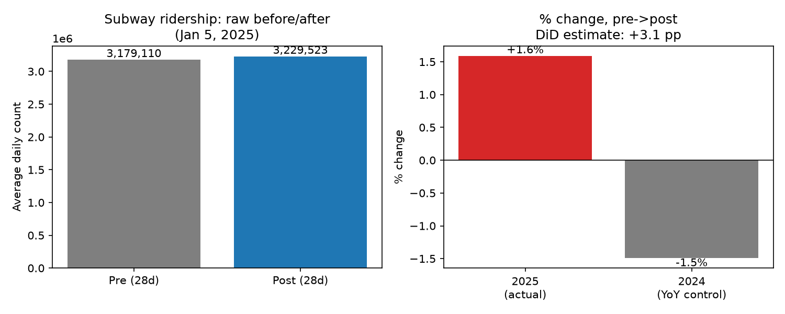
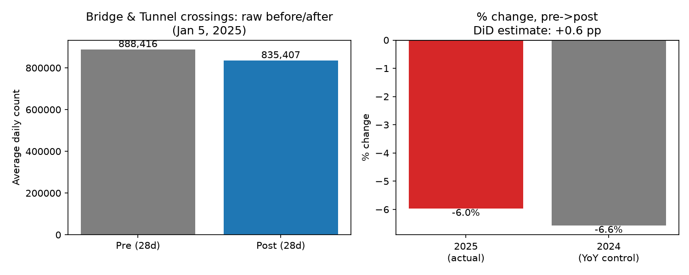
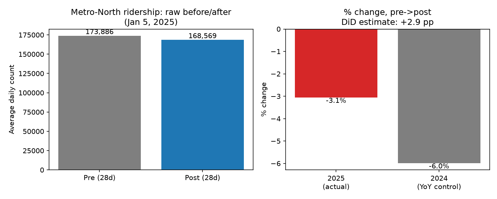

# HW0 — NYC Transit & Congestion Pricing

**Question (from Class 1):** explore NYC transit data (subway, bridges, Metro-North) and assess
the impact of congestion pricing events on ridership.

**Data:** MTA Daily Ridership and Traffic: Beginning 2020 (`data.ny.gov`, sayj-mze2), daily counts
by mode, Jan 2021–Dec 2025 in this extract. Key policy dates from `data/MTA_Key_Dates.pdf`.

## Method

Congestion pricing for vehicles entering Manhattan below 60th St began **Jan 5, 2025**. I compared
average daily ridership/crossings in the 28 days before vs. the 28 days after that date, for:

- **Subway**
- **BT** (Bridges & Tunnels — all MTA crossings, not just ones leading into the congestion zone)
- **MNR** (Metro-North)
- **CRZ Entries** (vehicles entering the Congestion Relief Zone itself — this series only exists
  from Jan 2025 onward, so it has no "before" period to compare against)

**A naive before/after comparison is confounded**: every year in this data shows a dip in
ridership/traffic around the New Year's holiday (visible in all three time series below), and all
three series are also on a multi-year upward trend as post-COVID ridership recovers. A 28-day
window straddling Jan 5 captures both effects regardless of congestion pricing.

To net this out, I added a **year-over-year control**: the same 28-day-before/28-day-after window
one year earlier (Dec 2023–Feb 2024), when no comparable policy changed. The difference between the
2025 change and the 2024 ("normal year") change is a simple difference-in-differences estimate of
the effect attributable to congestion pricing, rather than to the ordinary seasonal pattern.

## Results

| Mode | Pre (28d avg) | Post (28d avg) | Raw % change | 2024 seasonal norm | **DiD estimate** |
|---|---:|---:|---:|---:|---:|
| Subway | 3,179,110 | 3,229,523 | +1.6% | -1.5% | **+3.1 pp** |
| Bridges & Tunnels | 888,416 | 835,407 | -6.0% | -6.6% | **+0.6 pp** |
| Metro-North | 173,886 | 168,569 | -3.1% | -6.0% | **+2.9 pp** |

*(pp = percentage points, i.e. how much more/less the 2025 change was than the "normal" seasonal
change observed in the same calendar window a year earlier)*

Full time series with all policy dates marked (red = congestion pricing, grey = other fare/toll
changes) are in `analysis/output/timeseries_*.png`.

## Interpretation

- **Subway (+3.1pp) and Metro-North (+2.9pp) ridership grew faster than the normal seasonal
  pattern** in the month after congestion pricing began. This is directionally consistent with the
  policy's intent: raising the cost of driving into the Manhattan core should push some trips onto
  transit.
- **Aggregate bridge & tunnel crossings barely moved relative to the seasonal norm (+0.6pp)** — the
  raw 6% drop is almost entirely the usual Dec→Jan seasonal dip, not a congestion-pricing effect.
  This is a weaker test than it looks, though: `BT` bundles *every* MTA crossing, including several
  (e.g. Verrazzano, Throgs Neck, Whitestone) that don't lead into the congestion zone at all, which
  dilutes any effect specific to Manhattan-bound trips.
- **`CRZ Entries`** — the series that actually measures vehicles entering the priced zone — has no
  pre-period to compare against, since it didn't exist before congestion pricing. It settles into a
  roughly 470,000–500,000/day range through most of 2025 after an initial few weeks of lower/noisier
  readings (partly a rolling-average edge effect from the start of the series, not necessarily a
  real ramp-up).

**Bottom line:** the data are consistent with a modest shift toward transit (subway, Metro-North) in
the month after congestion pricing began, while total bridge/tunnel traffic — a broader, diluted
measure — didn't visibly change once normal seasonality is accounted for. This is an exploratory
28-day comparison, not a causal estimate: no weather controls, no adjustment for the concurrent
Jan 4, 2026 fare/toll increase encroaching on later data, and a single pre/post window is noisy.
A more rigorous version would use daily fixed effects, weather/holiday controls, and a longer
post-period.

## Files
- `data/MTA_Daily_Ridership_and_Traffic__Beginning_2020.csv` — source data
- `data/MTA_Key_Dates.pdf` — policy/price change reference dates
- `analysis/congestion_pricing_analysis.py` — analysis script (reproducible: `python congestion_pricing_analysis.py`)
- `analysis/output/` — generated charts + `summary.csv`
